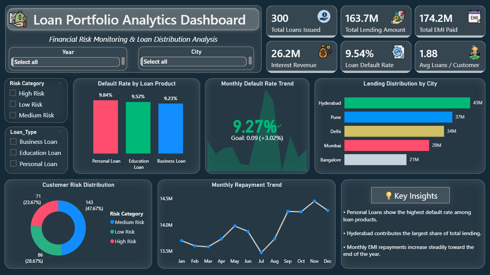

# Loan Portfolio Analytics Dashboard

## Project Overview
This project presents an interactive Power BI dashboard designed to analyze loan portfolio performance, lending distribution, and default risk.  
The dashboard provides insights into loan issuance, repayment trends, customer risk segmentation, and lending distribution across cities.

---

## Key Metrics
• Total Loans Issued  
• Total Lending Amount  
• Interest Revenue  
• Loan Default Rate  
• Average Loans per Customer  

---

## Dashboard Features
• Interactive slicers for Year, City, Loan Type, and Risk Category  
• Monthly repayment and default rate trend analysis  
• Lending distribution across cities  
• Loan default monitoring against target rate  
• Customer risk segmentation visualization  

---

## Tools & Technologies
• Power BI  
• DAX (Data Analysis Expressions)  
• Power Query  
• Data Modeling  

---

## Dashboard Preview

